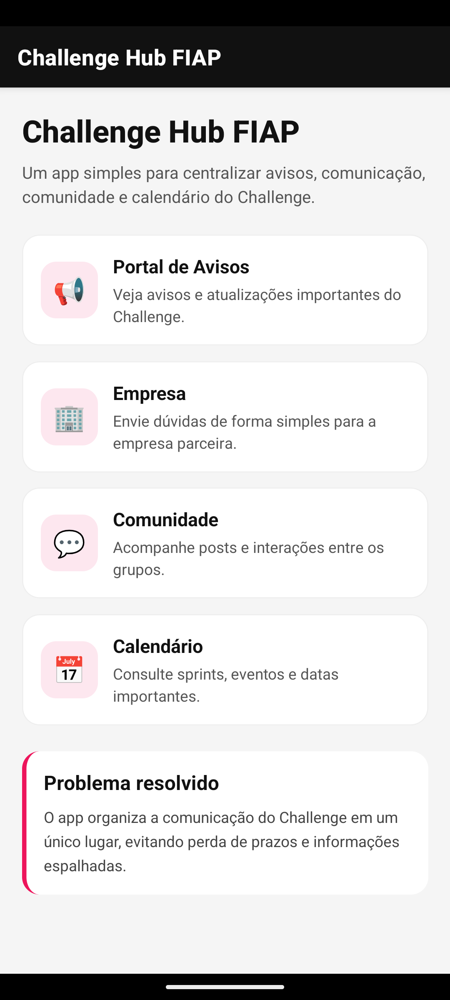
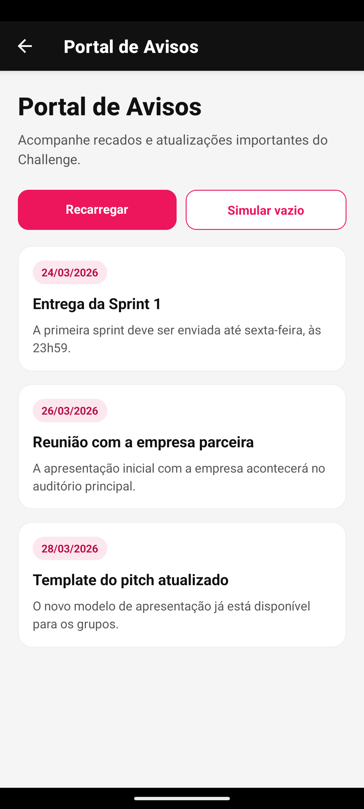
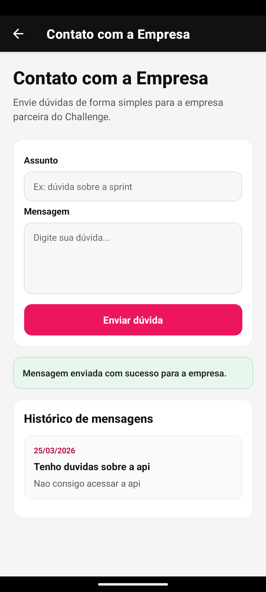
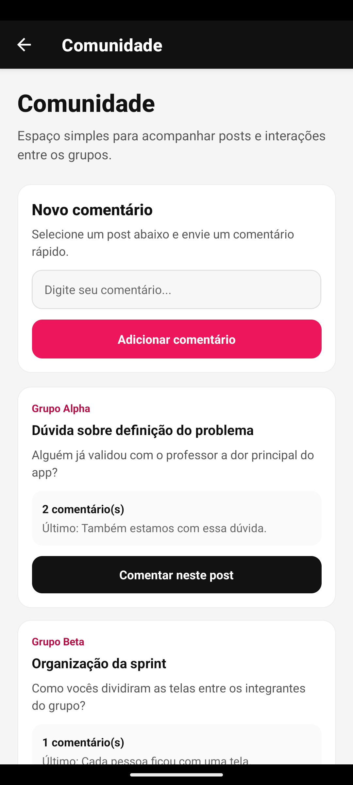
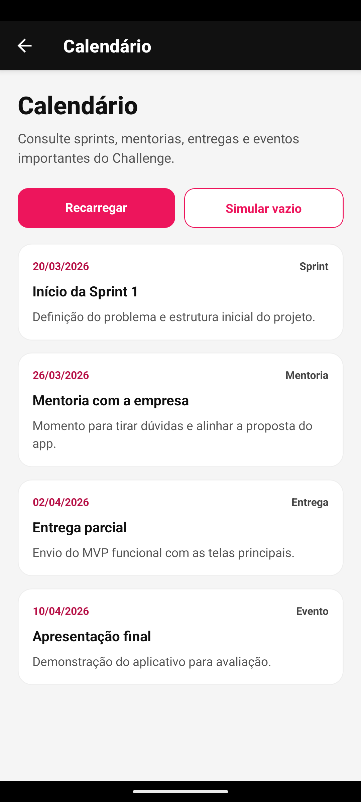

# Challenge Hub FIAP


Aplicativo mobile desenvolvido em **React Native + Expo** com o objetivo de **centralizar a comunicação do Challenge FIAP** em um único lugar.

O projeto foi pensado como um **MVP simples, funcional e visualmente organizado**, voltado para um problema real do dia a dia acadêmico: a dificuldade de acompanhar **avisos, eventos, comunicação com a empresa parceira e interações entre os grupos** durante o Challenge.

---

## Visão Geral

Durante o Challenge FIAP, muitas informações podem ficar espalhadas em diferentes canais, o que pode gerar:

- perda de prazos importantes
- dificuldade para acompanhar avisos
- comunicação desorganizada com a empresa parceira
- pouca centralização das interações entre grupos

Pensando nisso, o grupo desenvolveu o **Challenge Hub FIAP**, um aplicativo mobile que reúne as principais informações do Challenge em um só lugar.

---

## Problema Escolhido

O problema escolhido foi a **falta de centralização da comunicação do Challenge FIAP**.

Atualmente, avisos, datas, dúvidas e interações podem ficar dispersos, dificultando a organização dos alunos e o acompanhamento do projeto ao longo das sprints.

---

## Solução Proposta

O **Challenge Hub FIAP** foi criado para melhorar essa operação interna por meio de um app mobile com navegação simples e interface objetiva.

A proposta do app é reunir em um único ambiente:

- **Portal de Avisos**
- **Contato com a Empresa**
- **Comunidade**
- **Calendário do Challenge**

---

## Funcionalidades Implementadas

### Home
Tela inicial com apresentação do aplicativo e atalhos para as principais áreas.

### Portal de Avisos
Tela com avisos mockados relacionados ao Challenge, contendo:

- título
- descrição
- data
- loading simulado
- estado vazio

### Contato com a Empresa
Tela com formulário simples para envio de dúvidas, contendo:

- campo de assunto
- campo de mensagem
- validação dos campos
- feedback de sucesso ou erro
- histórico local de mensagens enviadas

### Comunidade
Tela com posts mockados da comunidade, contendo:

- autor do post
- título
- conteúdo
- quantidade de comentários
- seleção de post
- adição de comentário local

### Calendário
Tela com eventos importantes do Challenge, incluindo:

- sprints
- mentorias
- entregas
- apresentação final
- loading simulado
- estado vazio

---

## Justificativa da Operação Escolhida

O grupo escolheu trabalhar com a comunicação do Challenge porque esse é um processo importante dentro da rotina acadêmica da FIAP e pode ser significativamente melhorado com um aplicativo mobile.

A centralização das informações facilita a organização dos alunos, melhora o acompanhamento das etapas do projeto e reduz o risco de perda de avisos e datas importantes.

---

## Tecnologias Utilizadas

- **React Native**
- **Expo**
- **Expo Router**
- **JavaScript**
- **StyleSheet**
- **useState**
- **useEffect**

---

## Requisitos Técnicos Atendidos

O projeto foi desenvolvido seguindo os requisitos propostos no checkpoint:

- projeto iniciado com **Expo CLI**
- uso de componentes core do React Native:
  - `View`
  - `Text`
  - `Image`
  - `TouchableOpacity`
- componentização
- gerenciamento de estado com `useState`
- uso de efeito com `useEffect`
- estilização com `StyleSheet`
- pelo menos **3 telas distintas**
- navegação implementada com **Expo Router**
- navegação funcional entre todas as telas

### Diferenciais implementados

- feedback visual ao usuário
- estados vazios
- loading simulado
- interface simples, limpa e coerente com a proposta visual do projeto

---

## Estrutura do Projeto

```bash
app/
  _layout.js
  index.js
  avisos.js
  empresa.js
  comunidade.js
  calendario.js

components/
  Header.js
  MenuCard.js
  PlaceholderScreen.js
  AvisoCard.js
  PostCard.js
  EventoCard.js

data/
  avisos.js
  posts.js
  eventos.js
```

---

## Integrantes do Grupo

- **Matheus Morelli RM: 562765**
- **Lucas Eiki RM: 561607**
- **Victor Nicolas RM: 564804**
- **Rafael Ferreira RM: 563285**

---

## Como Rodar o Projeto

### Pré-requisitos

Antes de executar o projeto, é necessário ter instalado:

- **Node.js**
- **npm**
- **Expo Go** no celular  
ou
- **Android Studio** com emulador Android

### Passo a passo

Clone o repositório:

```bash
git clone https://github.com/matheeusvx/CP01-CrossPlatform.git
```

Acesse a pasta do projeto:

```bash
cd fiap-cpad-cp1-challenge-hub
```

Instale as dependências:

```bash
npm install
```

Inicie o projeto:

```bash
npx expo start
```

Depois disso, basta abrir no **Expo Go** ou rodar no **emulador Android**.

---

## Demonstração

### Link do vídeo de demonstração

[Assista ao vídeo de demonstração](https://youtube.com/shorts/JxqUphSbiW4)

### Prints das Telas

#### Home


#### Portal de Avisos


#### Contato com a Empresa


#### Comunidade


#### Calendário


---

## Decisões Técnicas

O projeto foi estruturado de forma simples para atender ao escopo do checkpoint e ao nível atual de conhecimento do grupo.

### Organização do código

A aplicação foi dividida em:

- pasta `app/` para as telas
- pasta `components/` para componentes reutilizáveis
- pasta `data/` para os dados mockados

Essa divisão foi escolhida para deixar o projeto mais organizado e facilitar a manutenção.

### Hooks utilizados

#### `useState`
Foi utilizado para:

- controlar os inputs do formulário
- armazenar mensagens enviadas
- controlar comentários
- armazenar listas de avisos e eventos
- controlar estados de feedback

#### `useEffect`
Foi utilizado para:

- simular carregamento nas telas de avisos e calendário

### Navegação

A navegação foi implementada com **Expo Router**, permitindo a transição entre as telas:

- Home
- Avisos
- Empresa
- Comunidade
- Calendário

### Estilização

Toda a estilização foi feita com **StyleSheet**, mantendo consistência visual e uma interface simples, limpa e funcional.

---

## Commits e Colaboração no Git

O desenvolvimento foi dividido entre os integrantes do grupo para garantir colaboração no repositório.

### Organização dos commits

- **Commit 1:** estrutura inicial do app com home e navegação
- **Commit 2:** implementação da tela de avisos
- **Commit 3:** implementação da tela de contato com a empresa
- **Commit 4:** implementação das telas de comunidade e calendário

Cada integrante realizou sua contribuição individual no repositório, conforme exigido no checkpoint.

---

## Próximos Passos

Com mais tempo, o grupo gostaria de evoluir o projeto com:

- autenticação de usuários
- persistência de dados
- integração real com a empresa parceira
- notificações de avisos
- calendário dinâmico
- comunidade com comentários em tempo real

---

## Conclusão

O **Challenge Hub FIAP** foi desenvolvido como uma solução simples para melhorar a organização e a comunicação do Challenge dentro da faculdade.

Mesmo sendo um MVP básico, o aplicativo já demonstra como um app mobile pode ajudar a centralizar informações importantes, melhorar a experiência dos alunos e tornar o acompanhamento do projeto mais prático.

---
