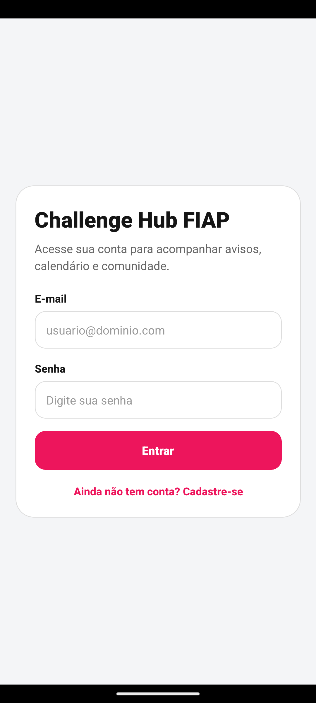
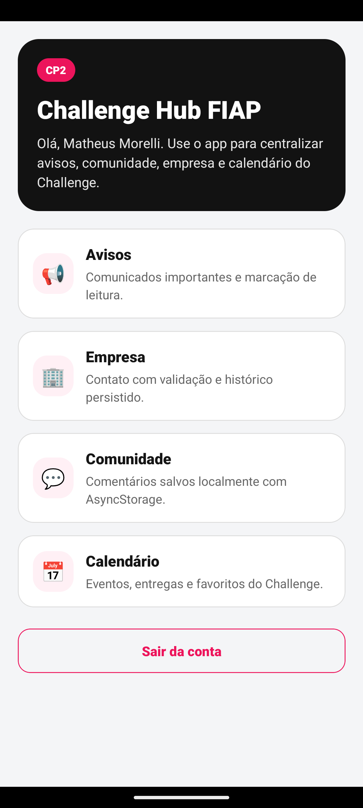
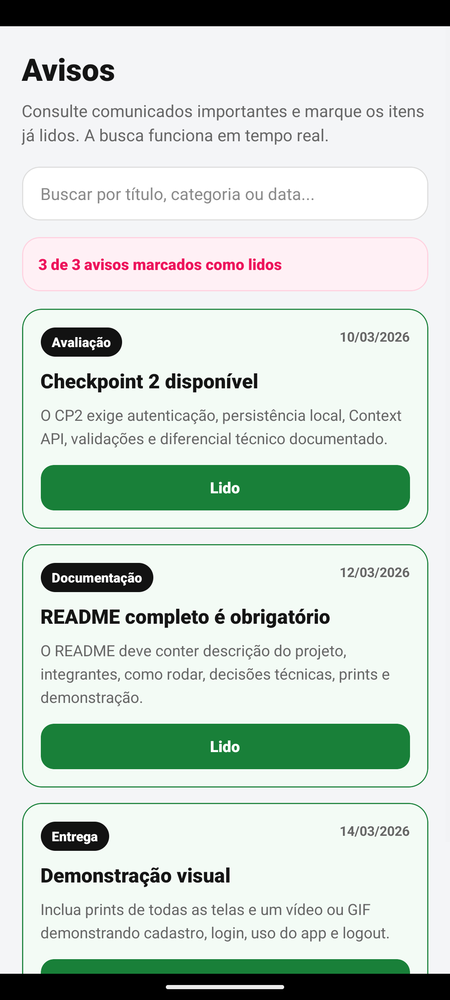
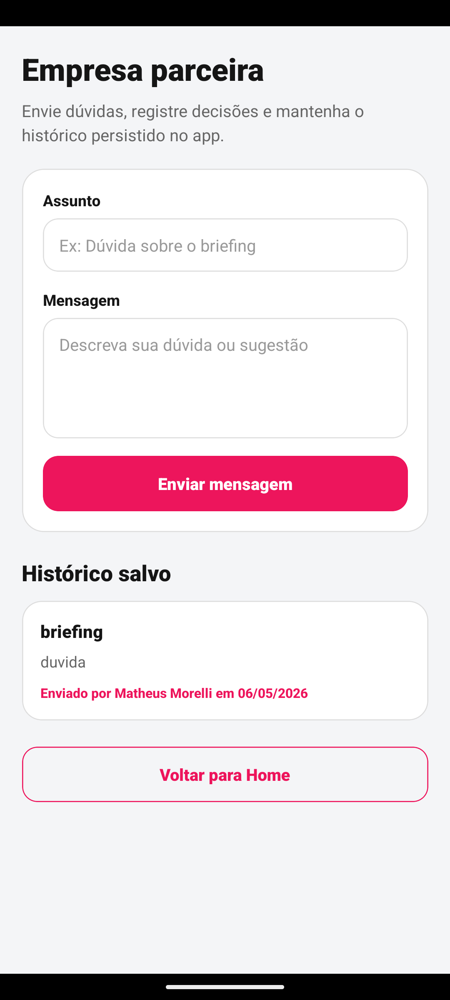
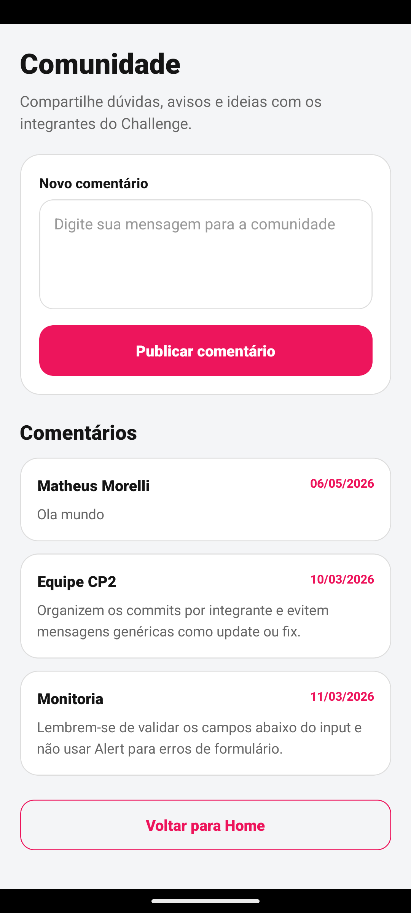
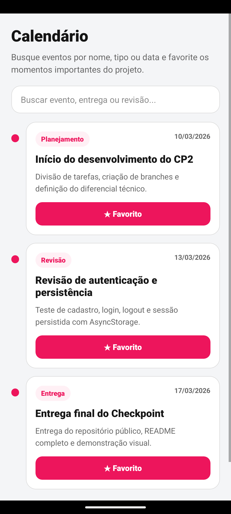

# Challenge Hub FIAP


Aplicativo mobile desenvolvido em **React Native + Expo** para centralizar a comunicação e organização do **Challenge FIAP**.

O projeto evoluiu do MVP entregue no CP1 para uma versão mais completa no CP2, incorporando **autenticação de usuários**, **persistência local com AsyncStorage**, **gerenciamento de estado global com Context API**, **formulários com validação**, **navegação protegida** e **busca em tempo real**.

---

## Visão Geral

Durante o Challenge FIAP, muitas informações importantes podem ficar espalhadas em diferentes canais, como mensagens, grupos, avisos, planilhas e orientações passadas em aula.

Isso pode gerar:

- perda de prazos importantes;
- dificuldade para acompanhar avisos;
- comunicação desorganizada com a empresa parceira;
- falta de histórico das interações;
- dificuldade para encontrar eventos, entregas e informações relevantes;
- pouca centralização das interações entre os grupos.

Pensando nisso, o grupo desenvolveu o **Challenge Hub FIAP**, um aplicativo mobile que reúne em um único lugar:

- autenticação de usuários;
- portal de avisos;
- contato com a empresa parceira;
- comunidade;
- calendário de eventos;
- busca e filtragem em tempo real;
- persistência local dos dados.

---

## Problema Escolhido

O problema escolhido foi a **falta de centralização da comunicação e organização do Challenge FIAP**.

No contexto acadêmico, avisos, datas, dúvidas, interações e entregas podem ficar distribuídos em vários canais. Isso dificulta o acompanhamento do projeto e aumenta o risco de atrasos, perda de informações e falta de alinhamento entre os integrantes.

---

## Solução Proposta

O **Challenge Hub FIAP** foi criado para melhorar a organização dos alunos durante o Challenge.

A solução propõe um app mobile com interface simples, navegação objetiva e funcionalidades práticas para centralizar as principais informações do projeto.

A aplicação permite que o usuário:

- crie uma conta;
- faça login com validação de credenciais;
- mantenha a sessão ativa ao reabrir o app;
- acesse telas protegidas apenas quando estiver autenticado;
- consulte avisos importantes;
- marque avisos como lidos;
- envie mensagens para a empresa parceira;
- visualize o histórico de mensagens enviadas;
- publique comentários na comunidade;
- acompanhe eventos do calendário;
- favorite eventos importantes;
- busque avisos e eventos em tempo real.

---

## Evolução em Relação ao CP1

No CP1, o projeto era um MVP com telas principais, navegação, dados mockados e interface inicial.

No CP2, o aplicativo foi evoluído com:

- autenticação de usuários;
- cadastro e login funcionais;
- persistência de usuário e sessão com AsyncStorage;
- persistência de dados funcionais do app;
- gerenciamento de estado global com Context API;
- validação explícita de formulários;
- mensagens de erro inline;
- navegação protegida;
- componentes reutilizáveis;
- busca e filtragem em tempo real;
- melhoria visual e de UX/UI;
- documentação técnica mais completa.

---

## Funcionalidades Implementadas

### Autenticação de Usuários

O app possui fluxo completo de autenticação local.

#### Cadastro

A tela de cadastro possui os campos:

- nome completo;
- e-mail;
- senha;
- confirmação de senha.

Validações implementadas:

- nome obrigatório;
- e-mail obrigatório;
- formato válido de e-mail;
- senha obrigatória;
- senha com mínimo de 6 caracteres;
- confirmação de senha obrigatória;
- confirmação de senha igual à senha;
- bloqueio de cadastro com e-mail já existente.

Os dados cadastrados são salvos localmente com **AsyncStorage**.

#### Login

A tela de login possui os campos:

- e-mail;
- senha.

Validações implementadas:

- e-mail obrigatório;
- formato válido de e-mail;
- senha obrigatória;
- validação das credenciais contra os dados salvos localmente.

Após login bem-sucedido, o usuário é redirecionado para a tela principal do app.

#### Sessão Persistida

O app salva a sessão do usuário no AsyncStorage.

Ao fechar e reabrir o aplicativo, se houver uma sessão válida, o usuário continua logado e não precisa fazer login novamente.

#### Logout

O app possui função de logout, que remove a sessão salva e redireciona o usuário para a tela de login.

---

### Home

Tela inicial exibida após o login.

A Home apresenta:

- nome do usuário logado;
- descrição do aplicativo;
- atalhos para as telas principais;
- botão de logout.

As opções disponíveis são:

- Avisos;
- Empresa;
- Comunidade;
- Calendário.

---

### Portal de Avisos

Tela destinada à consulta de comunicados importantes do Challenge.

Funcionalidades:

- listagem de avisos;
- exibição de título, categoria, descrição e data;
- marcação de aviso como lido;
- contagem de avisos lidos;
- persistência dos avisos marcados como lidos;
- busca em tempo real por título, categoria, descrição ou data;
- estado vazio quando nenhum resultado é encontrado.

---

### Contato com a Empresa

Tela destinada ao envio de mensagens para a empresa parceira.

Funcionalidades:

- formulário com assunto e mensagem;
- validação de campos obrigatórios;
- mensagens de erro inline;
- feedback de sucesso após envio;
- histórico de mensagens enviadas;
- persistência local do histórico com AsyncStorage.

Campos validados:

- assunto obrigatório;
- mensagem obrigatória.

---

### Comunidade

Tela destinada à interação entre alunos e integrantes do Challenge.

Funcionalidades:

- visualização de comentários;
- criação de novo comentário;
- validação de comentário vazio;
- mensagem de erro inline;
- feedback de sucesso;
- persistência local dos comentários com AsyncStorage.

---

### Calendário

Tela destinada ao acompanhamento de eventos importantes do Challenge.

Funcionalidades:

- listagem de eventos;
- exibição de tipo, data, título e descrição;
- favoritar eventos importantes;
- persistência dos eventos favoritos;
- busca em tempo real por título, tipo, descrição ou data;
- estado vazio quando nenhum evento é encontrado.

---

## Diferencial Técnico Implementado

### Busca e Filtragem em Tempo Real

O diferencial técnico escolhido foi a implementação de **busca e filtragem em tempo real**.

Esse recurso foi aplicado nas telas de:

- Avisos;
- Calendário.

A busca permite que o usuário encontre rapidamente informações importantes sem precisar navegar manualmente por toda a lista.

#### Justificativa

Esse diferencial foi escolhido porque melhora diretamente a experiência do usuário.

Em um app voltado para organização acadêmica, é comum que o usuário precise encontrar rapidamente:

- avisos específicos;
- entregas;
- revisões;
- datas;
- eventos;
- categorias importantes.

A busca em tempo real torna o app mais prático, mais útil e mais próximo de uma aplicação real.

---

## Tecnologias Utilizadas

- **React Native**
- **Expo**
- **Expo Router**
- **JavaScript**
- **AsyncStorage**
- **Context API**
- **StyleSheet**
- **useState**
- **useEffect**
- **useMemo**
- **Componentização**

---

## Requisitos Técnicos Atendidos

O projeto atende aos requisitos técnicos do CP2:

- projeto com **React Native + Expo**;
- navegação com **Expo Router**;
- uso de componentes core do React Native:
  - `View`;
  - `Text`;
  - `Pressable`;
  - `TextInput`;
  - `ScrollView`;
  - `ActivityIndicator`;
  - `KeyboardAvoidingView`;
- estrutura organizada em pastas;
- componentização;
- estilização com `StyleSheet`;
- autenticação de usuários;
- cadastro e login com dados persistidos;
- sessão persistida com AsyncStorage;
- logout com limpeza da sessão;
- persistência dos dados funcionais do app;
- leitura dos dados ao montar as telas;
- atualização dos dados após inserções e alterações;
- gerenciamento de estado global com Context API;
- telas protegidas para usuários autenticados;
- formulários com validação explícita;
- mensagens de erro inline;
- melhoria visual e de UX/UI;
- implementação de diferencial técnico;
- documentação completa no README.

---

## Context API

O projeto utiliza Context API para centralizar estados compartilhados entre telas.

### AuthContext

Arquivo:

```bash
context/AuthContext.js
```

Responsável por gerenciar:

- usuário logado;
- cadastro;
- login;
- logout;
- carregamento da sessão persistida;
- estado de autenticação.

Funções principais:

- `register()`;
- `login()`;
- `logout()`;
- `loadSession()`.

---

### AppDataContext

Arquivo:

```bash
context/AppDataContext.js
```

Responsável por gerenciar os dados funcionais do app.

Dados controlados:

- mensagens enviadas para a empresa;
- comentários da comunidade;
- avisos marcados como lidos;
- eventos favoritos.

Funções principais:

- `addMensagemEmpresa()`;
- `addComentario()`;
- `toggleAvisoLido()`;
- `toggleEventoFavorito()`.

---

## AsyncStorage

O AsyncStorage foi utilizado para persistência local dos dados.

### Chaves Utilizadas

Arquivo:

```bash
constants/storageKeys.js
```

Chaves utilizadas:

```js
USERS: '@challenge_hub:users'
SESSION: '@challenge_hub:session'
APP_DATA: '@challenge_hub:app_data'
```

### Dados Persistidos

O app persiste:

- usuários cadastrados;
- sessão do usuário logado;
- mensagens enviadas para a empresa;
- comentários da comunidade;
- avisos lidos;
- eventos favoritos.

---

## Validações de Formulários

As validações foram centralizadas no arquivo:

```bash
utils/validators.js
```

Validações implementadas:

- campo obrigatório;
- formato válido de e-mail;
- senha com mínimo de 6 caracteres;
- confirmação de senha igual à senha;
- validação de credenciais no login.

Os erros aparecem abaixo do campo correspondente, em vermelho, sem uso de `Alert`.

---

## Estrutura do Projeto

```bash
CP01-CrossPlatform/
├── app/
│   ├── _layout.js
│   ├── index.js
│   ├── login.js
│   ├── cadastro.js
│   ├── avisos.js
│   ├── empresa.js
│   ├── comunidade.js
│   └── calendario.js
│
├── components/
│   ├── Header.js
│   ├── MenuCard.js
│   ├── InputField.js
│   ├── PrimaryButton.js
│   ├── FeedbackMessage.js
│   ├── EmptyState.js
│   ├── SearchBar.js
│   ├── ScreenContainer.js
│   ├── AvisoCard.js
│   ├── PostCard.js
│   └── EventoCard.js
│
├── constants/
│   ├── colors.js
│   └── storageKeys.js
│
├── context/
│   ├── AuthContext.js
│   └── AppDataContext.js
│
├── data/
│   ├── avisos.js
│   ├── posts.js
│   └── eventos.js
│
├── utils/
│   └── validators.js
│
├── assets/
│   └── imagens do projeto
│
├── package.json
└── README.md
```

---

## Integrantes do Grupo

- **Matheus Morelli** — RM: 562765
- **Lucas Eiki** — RM: 561607
- **Victor Nicolas** — RM: 564804
- **Rafael Ferreira** — RM: 563285

---

## Organização dos Commits

O desenvolvimento foi organizado em quatro commits principais, um para cada integrante.

### Commit 1 — Matheus

```bash
feat: implementar base de autenticação com AsyncStorage
```

Responsabilidades:

- configuração da base técnica do CP2;
- criação das constantes;
- criação dos validadores;
- criação do AuthContext;
- implementação de cadastro;
- implementação de login;
- persistência da sessão;
- proteção inicial da Home.

Arquivos principais:

```bash
constants/colors.js
constants/storageKeys.js
utils/validators.js
context/AuthContext.js
app/_layout.js
app/login.js
app/cadastro.js
app/index.js
package.json
```

---

### Commit 2 — Lucas

```bash
feat: componentizar telas de autenticação e home
```

Responsabilidades:

- criação de componentes reutilizáveis;
- melhoria visual das telas de login e cadastro;
- componentização da Home;
- padronização de botões, inputs, mensagens e containers.

Arquivos principais:

```bash
components/InputField.js
components/PrimaryButton.js
components/FeedbackMessage.js
components/EmptyState.js
components/SearchBar.js
components/MenuCard.js
components/ScreenContainer.js
app/login.js
app/cadastro.js
app/index.js
```

---

### Commit 3 — Victor

```bash
feat: persistir dados funcionais do app com Context API
```

Responsabilidades:

- criação do AppDataContext;
- persistência dos dados funcionais do app;
- implementação do formulário da empresa;
- histórico de mensagens;
- comentários da comunidade;
- dados base de avisos, posts e eventos.

Arquivos principais:

```bash
context/AppDataContext.js
data/avisos.js
data/eventos.js
data/posts.js
app/_layout.js
app/empresa.js
app/comunidade.js
```

---

### Commit 4 — Rafael

```bash
feat: adicionar busca em tempo real e refinar telas do app
```

Responsabilidades:

- implementação da busca em tempo real;
- tela de avisos com filtro;
- tela de calendário com filtro;
- marcação de avisos lidos;
- eventos favoritos;
- refinamento visual das telas finais;
- correção das rotas de Empresa e Calendário.

Arquivos principais:

```bash
app/avisos.js
app/calendario.js
app/empresa.js
README.md
```

---

## Como Rodar o Projeto

### Pré-requisitos

Antes de executar o projeto, é necessário ter instalado:

- **Node.js**
- **npm**
- **Expo Go** no celular

ou

- **Android Studio** com emulador Android configurado.

---

### Passo a Passo

Clone o repositório:

```bash
git clone https://github.com/matheeusvx/CP01-CrossPlatform.git
```

Acesse a pasta do projeto:

```bash
cd CP01-CrossPlatform
```

Instale as dependências:

```bash
npm install
```

Instale o AsyncStorage, caso ainda não esteja instalado:

```bash
npx expo install @react-native-async-storage/async-storage
```

Inicie o projeto limpando o cache:

```bash
npx expo start -c
```

Para abrir no emulador Android:

```bash
npx expo start --android -c
```

Para abrir no navegador:

```bash
npx expo start --web
```

---

## Fluxo de Uso do App

Fluxo principal demonstrado no projeto:

1. Usuário abre o aplicativo.
2. Caso não esteja logado, é direcionado para Login.
3. Usuário acessa Cadastro.
4. Usuário informa nome, e-mail, senha e confirmação.
5. Dados são validados e salvos localmente.
6. Usuário é autenticado.
7. Home é exibida com os atalhos do app.
8. Usuário acessa Avisos.
9. Usuário busca avisos e marca itens como lidos.
10. Usuário acessa Empresa.
11. Usuário envia uma mensagem com assunto e descrição.
12. Mensagem fica salva no histórico.
13. Usuário acessa Comunidade.
14. Usuário publica um comentário.
15. Comentário fica salvo localmente.
16. Usuário acessa Calendário.
17. Usuário busca eventos e favorita itens importantes.
18. Usuário realiza logout.
19. Sessão é limpa e o app volta para Login.

---

## Demonstração Visual

### Link do Vídeo ou GIF


```bash
cadastro -> login -> uso do app -> avisos -> empresa -> comunidade -> calendario -> logout
```

Link:

```md
[Assista à demonstração do app](https://youtube.com/shorts/T8D9oqv1xL8?feature=share)
```

---

## Prints das Telas


### Login




### Home



### Avisos



### Empresa



### Comunidade



### Calendário



---

## Decisões Técnicas

### Uso do Expo Router

O Expo Router foi utilizado para organizar a navegação por arquivos dentro da pasta `app/`.

Cada tela do app possui um arquivo próprio:

```bash
app/login.js
app/cadastro.js
app/index.js
app/avisos.js
app/empresa.js
app/comunidade.js
app/calendario.js
```

Essa abordagem facilita a leitura do projeto e torna a navegação mais simples de manter.

---

### Uso do AsyncStorage

O AsyncStorage foi escolhido porque o requisito do CP2 exige persistência local dos dados.

Ele foi utilizado para salvar:

- usuários;
- sessão ativa;
- mensagens;
- comentários;
- avisos lidos;
- eventos favoritos.

Com isso, os dados continuam disponíveis mesmo após fechar e reabrir o aplicativo.

---

### Uso da Context API

A Context API foi utilizada para evitar passagem excessiva de props entre telas e componentes.

O projeto possui dois contextos principais:

- `AuthContext`, para autenticação;
- `AppDataContext`, para dados funcionais.

Essa separação deixa o código mais organizado e facilita a manutenção.

---

### Componentização

Foram criados componentes reutilizáveis para evitar repetição de código.

Componentes principais:

- `InputField`;
- `PrimaryButton`;
- `FeedbackMessage`;
- `EmptyState`;
- `SearchBar`;
- `MenuCard`;
- `ScreenContainer`.

Esses componentes ajudam a manter consistência visual entre as telas.

---

### Validação Inline

As validações dos formulários foram implementadas com mensagens abaixo dos campos correspondentes.

Essa decisão melhora a experiência do usuário, pois deixa claro qual campo precisa ser corrigido.

O projeto não utiliza `Alert` para validação de formulário.

---

### Busca em Tempo Real

A busca em tempo real foi implementada usando estado local e filtragem com `useMemo`.

Ela permite que o app atualize a lista exibida conforme o usuário digita.

Esse recurso foi aplicado em:

- Avisos;
- Calendário.

---

## Requisitos de UX/UI Atendidos

O projeto também foi refinado visualmente para atender aos requisitos de UX/UI do CP2.

Foram aplicados:

- hierarquia visual clara;
- títulos e subtítulos com pesos diferentes;
- paleta de cores coerente com o tema FIAP;
- botões padronizados;
- inputs com labels visíveis;
- mensagens de erro abaixo dos campos;
- feedback de sucesso;
- telas com espaçamento consistente;
- componentes reutilizáveis;
- `KeyboardAvoidingView` nas telas de formulário;
- `ScrollView` para evitar corte de conteúdo;
- estados vazios em listas filtradas.

---

## O Que Foi Persistido Localmente

| Dado | Onde é salvo | Chave |
|---|---|---|
| Usuários cadastrados | AsyncStorage | `@challenge_hub:users` |
| Sessão ativa | AsyncStorage | `@challenge_hub:session` |
| Mensagens da empresa | AsyncStorage | `@challenge_hub:app_data` |
| Comentários da comunidade | AsyncStorage | `@challenge_hub:app_data` |
| Avisos lidos | AsyncStorage | `@challenge_hub:app_data` |
| Eventos favoritos | AsyncStorage | `@challenge_hub:app_data` |

---

## Testes Manuais Realizados

Foram considerados os seguintes testes manuais:

- abrir o app sem usuário logado;
- redirecionar para a tela de login;
- criar novo cadastro;
- validar campos vazios no cadastro;
- validar e-mail inválido;
- validar senha menor que 6 caracteres;
- validar confirmação de senha divergente;
- realizar login com dados cadastrados;
- bloquear login com credenciais inválidas;
- manter sessão após fechar e reabrir o app;
- realizar logout;
- acessar Home somente autenticado;
- enviar mensagem para empresa;
- validar formulário da empresa vazio;
- verificar histórico de mensagens após reabrir o app;
- publicar comentário na comunidade;
- verificar persistência dos comentários;
- buscar avisos em tempo real;
- marcar aviso como lido;
- verificar persistência de aviso lido;
- buscar eventos no calendário;
- favoritar evento;
- verificar persistência de evento favorito.

---

## Possíveis Melhorias Futuras

Com mais tempo, o grupo poderia evoluir o projeto com:

- integração com backend real;
- autenticação com API;
- notificações locais com Expo Notifications;
- upload de imagem de perfil;
- modo escuro;
- filtros por categoria;
- calendário dinâmico;
- sincronização em nuvem;
- perfil do usuário;
- edição e exclusão de mensagens;
- edição e exclusão de comentários.

---

## Conclusão

O **Challenge Hub FIAP** evoluiu de um MVP simples para uma aplicação mobile mais completa e funcional.

Nesta versão, o app passou a contar com autenticação, persistência local, gerenciamento global de estado, formulários validados, navegação protegida, busca em tempo real e melhorias visuais.

A solução atende ao objetivo de centralizar informações importantes do Challenge FIAP e oferece uma experiência mais próxima de um produto real, que um usuário conseguiria utilizar no dia a dia acadêmico.

---
